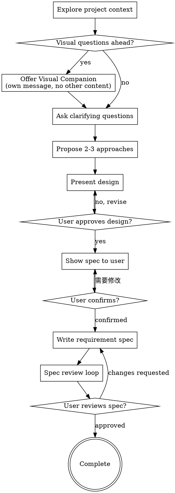

# Brainstorming Ideas Into Requirement Documents

Turn rough ideas into a validated requirement document through short, structured collaboration.

Start by understanding the request and surrounding context. Ask focused questions one at a time. Once the direction is clear, present a recommendation, get approval, then write the requirement document.

## When To Keep It Light

Not every task needs a heavyweight process. Use the smallest version of this workflow that still removes ambiguity.

- For intent requirements, prefer lightweight collection first and avoid detailed scenario decomposition unless the user asks for it.
- For formal requirement work, use the full document flow.

## Checklist

Complete these in order, but scale the depth to the task:

1. **Explore project context** - inspect relevant files, docs, and recent context.
2. **Offer visual companion** - only if upcoming questions are genuinely visual.
3. **Ask clarifying questions** - one at a time, focused on scope, constraints, and success criteria. For intent requirements, ask step by step according to the template sections and collect only the minimum information needed to produce the final template output.
4. **Propose 2-3 approaches** (optional) - for design decisions or when multiple solutions exist; include trade-offs and a recommendation.
5. **Present the design** - keep it proportional to complexity and get approval.
6. **Write the requirement spec** - show document to user, confirm completeness, then write to file.
7. **Run the spec review loop** - verify completeness and consistency.
8. **Ask the user to review the written spec** - finalize the document.

## Process Flow

## The Process

### 1. Explore Context

- Read only the files and documents needed to understand the request.
- Follow existing repository conventions when the work belongs to an existing codebase.
- If the deliverable is a requirement document, read `references/intent-requirement-template.md` before drafting.
- If the request implies multiple independent subsystems, pause and decompose before asking detailed questions.

### 2. Clarify One Question At A Time

**严格一次只问一个问题。** 必须等用户回答完当前问题后，才能问下一个问题。

For template-based requirement work, use the template as the questioning order. Ask only for the current section you are filling, then move to the next section after you have enough confirmed information.

**禁止行为**：

- 不要把两个或多个步骤合并在一起问
- 不要在一个问题中列出多个选项让用户选择
- 不要提前透露后续步骤的内容

Focus on:

- purpose and business goal
- scope and boundaries
- user roles or stakeholders
- inputs, outputs, and interfaces
- rules, constraints, and exceptions
- success criteria

For requirement-document work, also pin down:

- document type: intent requirement, business requirement, optimization, or technical change
- whether the output should stay high-level or become implementation-ready

For intent requirements, default to this lighter collection set:

- project background
- desired objective
- involved parties or roles
- high-level function scope
- known constraints or dependencies
- only confirmed information that can be written into the document

For `references/intent-requirement-template.md`, the default questioning order is:

1. document title / project theme
2. business background (including participating users, roles, and channels)
3. main business scenarios (collect all scenario names first)
4. process flow for each scenario
5. business risks, if the template requires them
6. **功能清单确认** - 基于已收集的场景和流程自动生成功能清单表格，展示给用户确认，可提出增删改意见

**注意**：第7步不是提问，而是展示自动生成的功能清单供用户确认。用户确认功能清单后，再进入第二阶段生成完整文档。

**功能清单生成规则**：

- **一级功能名称**：多个业务场景的共性模块/业务域（如：水费管理、水费缴费）
- **二级功能名称**：具体的业务场景功能（如：水费签约、水费解约、签约查询）
- 多个相关业务场景归为一个一级功能，场景本身作为二级功能

Do not jump ahead to later sections if an earlier required section is still missing essential information.

**场景和流程的提问示例**：

❌ 错误（合并提问）：
"请描述主要业务场景：水费签约场景...水费解约场景..."

✅ 正确（一次一问）：

- 问："主要业务场景有哪些？"
- 用户："签约、解约"
- 问："先描述【签约】场景的流程"
- （等用户回答完）
- 问："再描述【解约】场景的流程"

**用户输入`无`的处理**: 当用户针对某章节输入`无`时，表示该章节无内容或暂不需要填写，可直接跳过该章节进入下一项，不要求补充信息。

**理解用户输入**: 用户的输入可能不够规范或完整。我应该：

- 理解用户的真实意图，而不是机械按字面执行
- 如果用户输入有歧义或不清晰，主动澄清确认
- 将用户的口语化/零散描述转化为规范的需求文档语言
- 在展示文档给用户确认时，呈现优化后的规范表述

**判断回答有效性**: 每次收到用户回答后，判断是否合理：

- **合理**: 继续下一步
- **不合理/乱回复**（如答非所问、明显错误、无关内容）: 礼貌指出并重新提问，例如"这个回答似乎与问题不太匹配，请重新描述..."
- **部分合理**: 确认理解正确后，补充提问获取缺失信息

**提问方式**：每个问题提供**3个示例选项**供用户选择或参考，例如：

> 请描述本次需求的业务目标：
>
> - A. 实现客户通过智能柜员机办理水费代扣业务的签约和解约功能
> - B. 实现企业客户在线办理批量水费代扣签约
> - C. 实现客户通过手机银行办理水费代扣签约和解约
>
> 请选择 A/B/C，或输入您自己的描述。

Do NOT force detailed business scenarios, page flows, field lists, or exception branches unless:

- the user explicitly asks for a detailed requirement
- the topic is impossible to understand without them
- the later template sections would otherwise be factually incomplete

If required content for the template is missing, ask follow-up questions before drafting. Do not skip required sections, and do not silently downgrade the output structure.

### 3. Propose Approaches (Optional)

Propose 2-3 options when:

- There are multiple valid design or solution approaches
- The user needs to make a scope or architecture decision
- Trade-offs between alternatives are meaningful

Skip this step for straightforward requirement documentation where the scope is already clear.

For each option:

- describe the shape of the solution
- call out trade-offs
- recommend one option and explain why

### 4. Present The Design

Present only enough structure for the task at hand.

- Small task: short recommendation plus key assumptions.
- Medium task: sections such as scope, flow, components, risks, and validation.
- Formal requirement work: present the planned document outline before drafting the full text.
- Intent requirement work: present a concise collection summary first, then turn it into the template's final display form.

Ask for approval before moving on.

### 5. Write The Spec

**必须先获得用户确认**

在写入文件之前：

1. 向用户展示**完整的需求文档内容**（包含所有章节：需求概述、业务背景、业务风险、功能需求、业务场景、业务流程、功能清单）
2. 明确询问："以上内容是否完整？是否有遗漏的功能需要补充？"
3. 等待用户确认或提出修改意见
4. 用户确认无误后，才写入文件

- write to `specs/YYYY-MM-DD-<topic>-design.md` unless the user gave another path
- keep wording concise, direct, and implementation-relevant
- for requirement documents, follow `references/intent-requirement-template.md`
- when the request is an intent requirement, treat the template as the required final structure and write only confirmed content
- if the template requires content that has not yet been confirmed and user did not input `无`, pause drafting and ask the user for the missing information
- do NOT commit to git unless the user explicitly asked for a commit

**处理修改请求**：用户在确认阶段可以提出任何修改（文字调整、补充细节、新增功能、变更流程等）。根据修改范围选择处理方式：

- 小范围修改：直接修改后重新展示
- 大范围修改：按需补充提问，更新文档后重新展示

无论何种修改，都在写入文件前完成，用户确认无误后才写入。

### 6. Spec Review Loop

**仅在用户确认写入文件后执行**

1. Dispatch the spec reviewer using `spec-document-reviewer-prompt.md`.
2. Fix issues and re-dispatch until approved.
3. Stop after 5 iterations and surface remaining issues to the user.

### 7. User Review Gate

After the review loop passes, ask the user to review the written spec:

> "需求文档已写入 `<path>`。请审阅，如需修改请告诉我。"

If the user requests changes:

- 如果是遗漏功能，返回第3步补充收集信息
- 如果是文档表述问题，直接修改并重新运行审查循环

The process completes when the user approves the final document.

## Requirement-Document Rule

When the request is for a requirement document:

- use `references/intent-requirement-template.md` as the default structure reference
- **strictly follow the template structure**
- **completely ignore and do not output**: 系统对接要求, 数据校验规则, 非功能性要求, 实施计划建议, 测试要求, 接口规范, 安全要求, or any sections not defined in the template
- prefer formal, restrained, enterprise wording
- make rules and exceptions explicit
- keep the document self-contained
- only imitate a different template when the user explicitly asks
- if information is not confirmed, do not invent it and do not write speculative placeholders into the requirement body
- if template-required content is missing, ask the user to supplement it before finalizing the document

Keep the main skill focused on workflow. Put template details in `references/`.

## Key Principles

- **One question at a time** - avoid overwhelming the user.
- **Smallest sufficient process** - use the lightest workflow that still removes ambiguity.
- **Collect before expanding** - for intent requirements, gather enough to write a useful summary before asking for detailed scenarios.
- **Only write confirmed content** - do not write uncertain assumptions, placeholders, or speculative details into the requirement body.
- **Ask for missing required content** - if the template needs something that is missing, ask the user instead of guessing or omitting it.
- **Explore alternatives** - compare options before locking in.
- **Approval before file write** - show document to user and get explicit confirmation before writing to file.
- **Template-strict for requirements** - use the reference template as the required output structure unless told otherwise.
- **No default git actions** - do not commit unless asked or clearly required.
- **Fail open** - if a sample or detail is missing, use the default framework and proceed.

## Visual Companion

A browser-based companion for mockups, diagrams, and other visual explanations. This is a tool, not a mode.

Offer it only when the upcoming question is genuinely visual. The offer must be its own message:

> "Some of what we're working on might be easier to explain if I can show it to you in a web browser. I can put together mockups, diagrams, comparisons, and other visuals as we go. This feature is still new and can be token-intensive. Want to try it? (Requires opening a local URL)"

Do not combine that offer with any other content.

If the user accepts, decide per question whether to use the browser or terminal:

- Use the browser for mockups, layouts, diagrams, or visual comparisons.
- Use the terminal for scope questions, trade-offs, text alternatives, and requirement clarifications.

If they accept, read `visual-companion.md` before using it.
